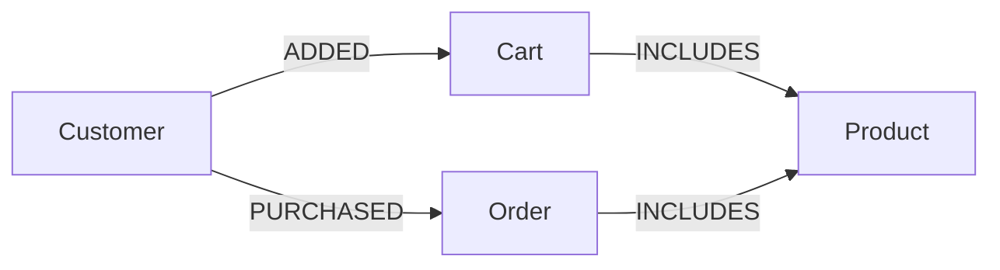

## Проектирование графовой модели данных

Графовая модель данных отличается от традиционных реляционных моделей, предлагая новый подход к представлению и организации данных.  В этой статье мы рассмотрим основы проектирования графовой модели, чтобы вы могли эффективно использовать Neo4j для решения различных задач.

### Основы графовой модели

В графовой модели данные представлены в виде узлов (nodes) и связей (relationships) между ними. 

* **Узлы:**  Представляют собой объекты или сущности в вашей модели. Например, в социальной сети узлами могут быть люди, в электронной коммерции - товары и пользователи.
* **Связи:** Описывают взаимосвязи между узлами. Например, в социальной сети связь "ДРУЖИТ" может соединять два человека, в электронной коммерции связь "КУПИЛ" может соединять пользователя и товар.

#### Пример: Социальная сеть

Представьте себе простую социальную сеть. 

| Узел         | Свойство    | Значение  |
|--------------|-------------|-----------|
| User         | name       | John Doe  |
| User         | age        | 30        |
| User         | email      | john@doe.com |
| Post         | text       | "Hello World!" |
| Post         | created_at | 2023-10-27 |

| Связь           | Тип           | Узел 1  | Узел 2    | Свойство | Значение |
|-----------------|---------------|---------|------------|-----------|----------|
| POSTED          | PUBLISHED      | User    | Post      | likes     | 10       |
| LIKED           | LIKED         | User    | Post      | date      | 2023-10-28 |

### Шаги проектирования графовой модели

1. **Определение сущностей:** Начните с идентификации основных сущностей в вашей предметной области. Это могут быть люди, товары, события, места и т.д.
2. **Определение связей:**  Определите, как эти сущности связаны между собой. Для каждой связи определите ее тип (например, "ДРУЖИТ", "КУПИЛ", "РАБОТАЕТ", "ПОСЕТИЛ") и свойства, которые могут быть ей присвоены.
3. **Выбор свойств:**  Определите свойства, которые нужно хранить для каждого узла и связи. Свойства могут быть текстовыми, числовыми, датами и т.д.
4. **Проверка модели:**  Проверьте, насколько гибкой и масштабируемой является ваша модель. Убедитесь, что она позволяет эффективно выполнять запросы и анализировать данные.

### Пример: Электронная коммерция

Предположим, мы хотим создать графовую модель для электронной коммерции.

**Сущности:**

* **Товары:** (Product) -  Название, описание, цена, категория
* **Пользователи:** (Customer) - Имя, адрес, электронная почта
* **Заказы:** (Order) - Дата заказа, статус, общая стоимость
* **Корзина:** (Cart) - Товары, добавленные в корзину пользователем

**Связи:**

* **КУПИЛ:** (PURCHASED) -  Соединяет пользователя с заказом.
* **ВКЛЮЧАЕТ:** (INCLUDES) -  Соединяет заказ с товарами.
* **ДОБАВИЛ:** (ADDED) -  Соединяет пользователя с товаром в корзине.

**Свойства:**

* **Товары:**
    * `name`: Название товара
    * `description`: Описание товара
    * `price`: Цена товара
    * `category`: Категория товара
* **Пользователи:**
    * `name`: Имя пользователя
    * `email`: Электронная почта пользователя
    * `address`: Адрес пользователя
* **Заказы:**
    * `order_date`: Дата заказа
    * `order_status`: Статус заказа
    * `total_amount`: Общая стоимость заказа
* **Корзина:**
    * `cart_items`: Список товаров в корзине

**Графовая модель:**

### Полезные советы

* **Используйте четкие и понятные имена узлов и связей.**
* **Определите тип связи, если он не очевиден.**
* **Избегайте создания лишних связей.**
* **Учитывайте потребности ваших запросов при проектировании модели.**
* **Проверяйте модель на гибкость и масштабируемость.**

### Заключение

Проектирование графовой модели данных является важным этапом работы с Neo4j.  Следуя описанным шагам и советам, вы сможете создавать эффективные и гибкие модели, которые помогут вам решать сложные задачи анализа данных.  
